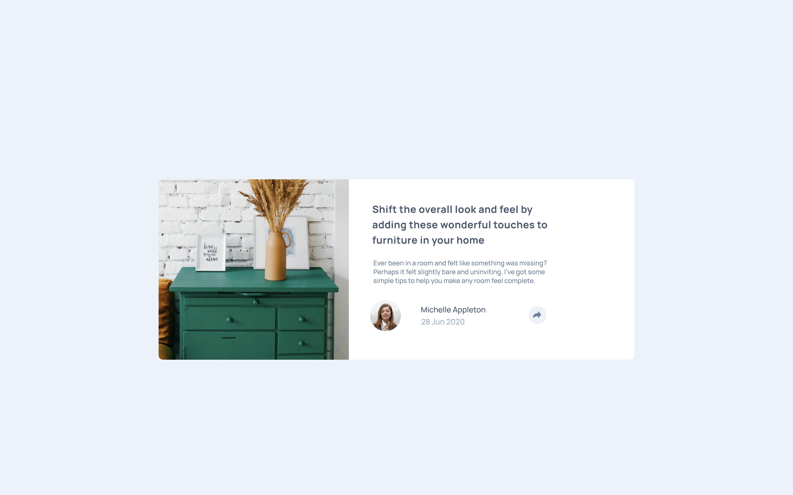
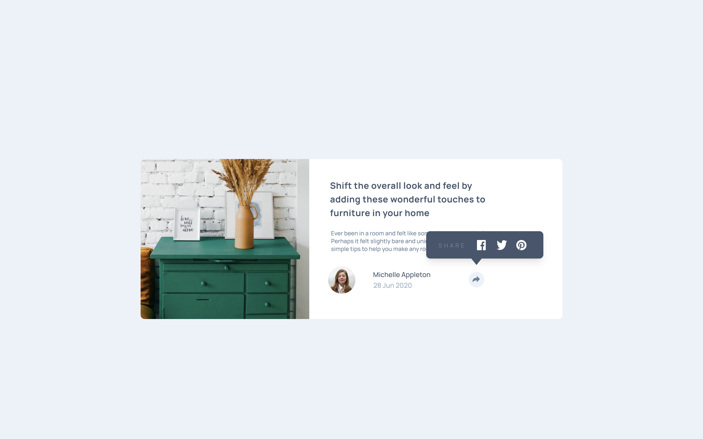
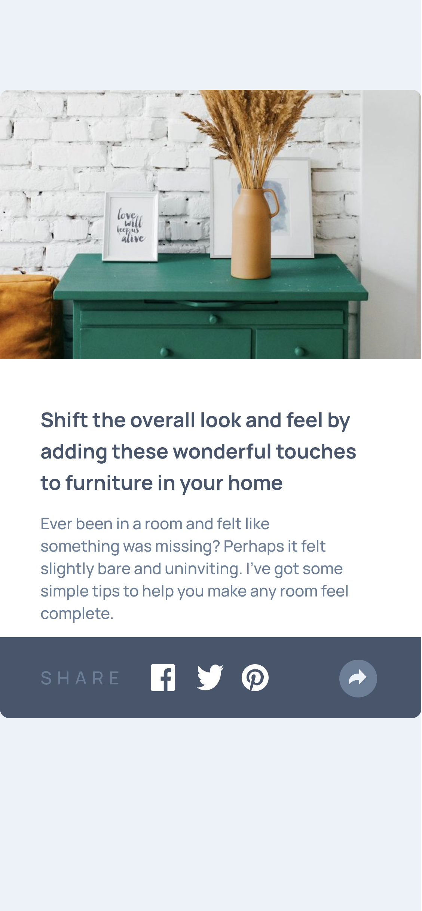

# Frontend Mentor - Article preview component solution

This is a solution to the [Article preview component challenge on Frontend Mentor](https://www.frontendmentor.io/challenges/article-preview-component-dYBN_pYFT). Frontend Mentor challenges help you improve your coding skills by building realistic projects.

## Table of contents

- [Overview](#overview)
  - [The challenge](#the-challenge)
  - [Screenshot](#screenshot)
  - [Links](#links)
- [My process](#my-process)
  - [Built with](#built-with)
  - [What I learned](#what-i-learned)
  - [Continued development](#continued-development)
  - [Useful resources](#useful-resources)
- [Author](#author)
- [Acknowledgments](#acknowledgments)

## Overview

### The challenge

Users should be able to:

- View the optimal layout for the component depending on their device's screen size
- See the social media share links when they click the share icon

### Screenshot

- Desktop version.
  
  

- Mobile version.
  
  

### Links

- Solution URL: [Source code on Github](https://github.com/Abaljerind/article-preview-component)
- Live Site URL: [Product Preview Card Component](https://article-preview-component-git-main-abaljerind.vercel.app/)

## My process

### Built with

- Semantic HTML5 markup
- [TailwindCSS](https://tailwindcss.com/) - For styles

### What I learned

Well, this is the first experience for me to do implementation in javascript using condition based on window width in different devices. And it was really a challenge for me.

```html
<h1>Some code I'm proud of</h1>
```

```js
const width = document.documentElement.clientWidth || window.innerWidth;

if (width <= 375) {
  ......
}
```

### Continued development

Well, as a starting point, what i made this far is still different from the design for desktop mode, as you can see, there's still a large space in the right of the text, so maybe in the future i can finally change fix it. And the image still zoom in little because the effect of the width maybe and because i use % not px.

### Useful resources

- [TailwindCSS](https://tailwindcss.com/) - This helped me to do the styling more easy. I really liked this tailwind css and will use it going forward.
- [Vercel](https://vercel.com) - This is an amazing website which helped me to upload my website into the internet. I'd recommend it to anyone still learning to use this website.

## Author

- Website - [AbalJerind](https://article-preview-component-git-main-abaljerind.vercel.app/)
- Frontend Mentor - [@Abaljerind](https://www.frontendmentor.io/profile/Abaljerind)

## Acknowledgments

I want to thank me for believing in me, I want to thank me for doing all this hard work. I wanna thank me for having no days off. I wanna thank me for never quitting. I wanna thank me for being me at all times.
